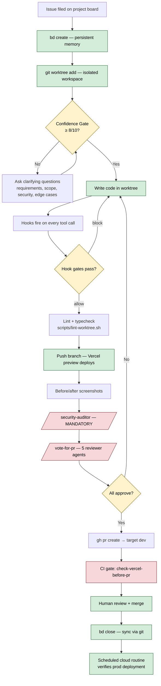

# Diagram 1 — Feature Lifecycle

The path a single feature takes from "user files an issue" to "merged in production." Every step is enforced by a hook, a hookify rule, or a non-negotiable workflow rule.

**Key beats for the demo:**

1. **Issue → bead → worktree are non-negotiable.** A `UserPromptSubmit` hook detects new tasks and reminds the operator to create all three before any code touches disk.
2. **The Confidence Gate is the most underrated step.** Forcing the orchestrator to reach 8/10 confidence *before* writing code prevents 60% of throwaway implementations.
3. **Hooks intercept tool calls in real time.** A `PreToolUse:Edit` hook can block a write to `.env` files. A `PreToolUse:Bash` hook can block `git push origin main`.
4. **`/security-auditor` is the only mandatory agent.** Everything else is right-sized by the orchestrator.
5. **The loop closes with a scheduled cloud routine.** A separate Claude agent runs on cron 24-72 hours post-merge to verify the fix actually shipped to prod (catches silent failures).
