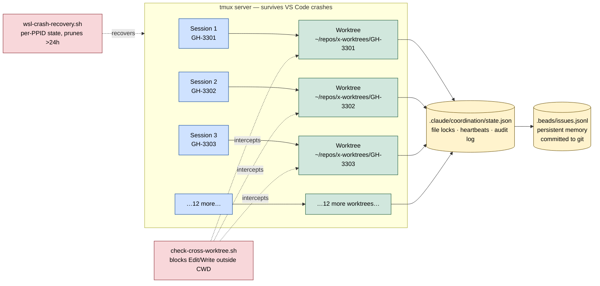

# Diagram 2 — 15 Parallel Sessions Without Collision

How a single developer can have 15 Claude Code sessions running concurrently, each on a different feature, without merge conflicts, lost work, or "which session is editing this file?" chaos.

**Why this works:**

| Mechanism | What it prevents |
|---|---|
| **Worktree per feature** | Branch conflicts. Each session has its own working tree, own `.git/` index. |
| **`check-cross-worktree.sh` hook** | A session in worktree A from accidentally editing a file in worktree B. Hook returns exit 2; the model sees the error and corrects course. |
| **`state.json` file locks** | Two sessions editing the same shared file (e.g., `database.ts`). Soft locks with stale-cleanup at 30 min idle. |
| **Beads (`bd`)** | Lost context. Each session writes its task into `.beads/issues.jsonl`, committed to git, readable from any worktree. |
| **tmux** | VS Code crashes killing your work. Sessions run in tmux server independent of any IDE. |
| **`wsl-crash-recovery.sh`** | WSL2 crashes (the OS layer below tmux). On next session start, the hook detects stale state files and prints continuation prompts you copy-paste back. |

**Scale answer for the demo:** with WSL on `~/repos/` (ext4, not `/mnt/c/`), `git status` across 15 worktrees runs in <2 seconds total. On NTFS via 9P bridge, it would take 60+ seconds. **Filesystem choice is what makes 15 sessions feasible.**
