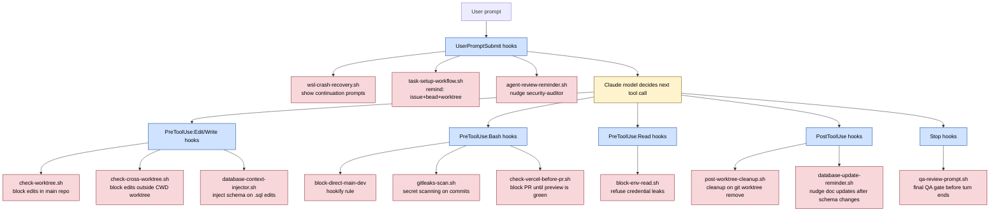

# Diagram 3 — The Hook Safety Net

Hooks are scripts that fire on Claude Code events: `PreToolUse`, `PostToolUse`, `UserPromptSubmit`, `Stop`. They turn policy documents into enforcement.

The model is the worker. The hooks are the guardrails.

**The two superpowers of hooks:**

1. **Block (exit 2)** — Stops the tool call. The model sees the stderr message and adjusts. Use for hard rules: don't edit `.env`, don't push to `main`, don't read credentials.
2. **Inform (exit 0 + stderr)** — Tool call proceeds, but the model is given context. Use for soft rules: warn about RLS on `CREATE TABLE`, remind about doc updates after schema changes.

**Demo moment**: in the live walkthrough, type `Read .env` into Claude Code. Watch `block-env-read.sh` refuse the operation in real time. The model immediately apologizes and pivots. *That's* the safety net.
