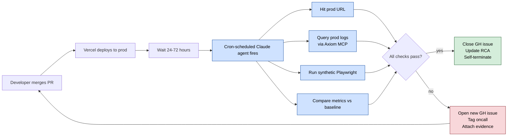

# Diagram 5 — The Scheduled Routine Flywheel

The most underappreciated piece of this setup: Claude agents that run **on cron, in the cloud, with no human in the loop**, verifying that fixes actually shipped to production.

This is what catches silent failures — bugs that pass review, pass CI, pass code review, *and* pass smoke tests, but break in prod for some specific edge case nobody anticipated.

**Real examples from production:**

| Routine | Purpose | What it catches |
|---|---|---|
| **Post-merge perf check** | 3 days after a perf PR, run synthetic Playwright on the affected pages, compare to pre-merge baseline | Regressions that pass synthetic load test but fail real-user scenarios |
| **Email compliance verify** | After unsubscribe-link fix, send 6 test emails through prod and verify every one has the correct headers (RFC 8058) | "Looks fine in dev, header missing in prod" silent failures |
| **Cron auth audit** | Weekly: hit every cron route with a wrong token, verify 401 returned (not 200) | Silent churn — broken cron returning 200 because auth wasn't checked |
| **Quarterly dependabot audit** | Cross-reference Dependabot alerts vs. pnpm overrides; classify as COVERED, ORPHAN, or MISSING | Orphaned security patches |
| **Registry reconcile** | Weekly: verify the routine registry doc is in sync with the live API | Drift between "what we think runs" and "what actually runs" |

**The meta-routine** is the punchline of the demo: a Claude agent whose job is to verify that the registry of Claude agents is correct. Self-auditing automation.

**Why it matters for the audience:** silent failures are the worst class of bugs. They don't page you. They don't show up in error monitors. They show up 6 weeks later when a customer asks "why didn't I get the email?" — and at that point, the trail is cold.

A cron'd Claude agent is the only thing cheap enough to run *on every release* and smart enough to read context, judge nuance, and file a useful issue when something is off.
