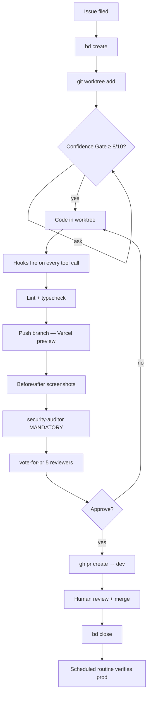
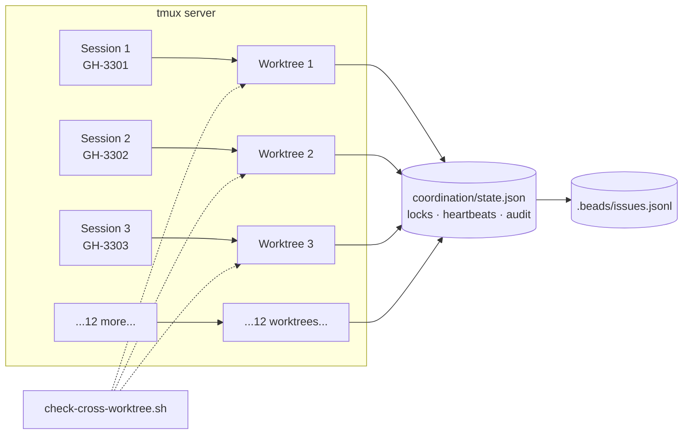
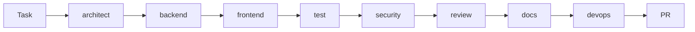
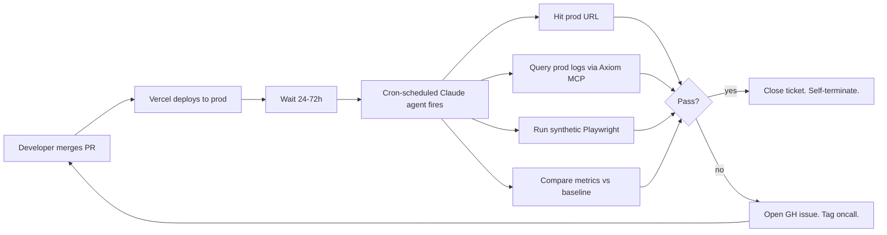

# Production-Grade Claude Code

How we run a SaaS on AI-assisted development without losing our mind

<div class="pt-12">
  <span class="px-2 py-1 rounded cursor-pointer" hover:bg="white opacity-10">
    Toolkit: github.com/zanebarker-ops/claude-dev-toolkit
  </span>
</div>

<!--
Speaker notes:
- Welcome the audience. Set the tone: this is not a tutorial.
- Today is about how AI coding looks in production, not in a sandbox.
- 60 minutes. Five acts. One take-home toolkit.
-->

---
layout: center
class: text-center
---

# The demo gap

Every AI coding demo you've seen is a tutorial.<br/>
A blank repo. A prompt. Magic. Applause.

You go home. You try it on your real codebase.<br/>
It falls over inside 30 minutes.

<div class="pt-12 text-2xl text-amber-400">
Today is not that demo.
</div>

<!--
- Build tension. Get them to nod.
- The pivot is: real codebases have RLS, migrations, three other devs, prod data, deploy gates.
- We're going to show you the parts that the tutorials skip.
-->

---

# What you've seen vs. what we ship

<div class="grid grid-cols-2 gap-8 pt-4">

<div>

### The tutorial

- Blank repo
- One prompt
- Single feature
- No deploy gate
- No reviewers
- No prod data
- No migrations
- No RLS

</div>

<div>

### Production reality

- 3-year codebase
- 15 parallel features in flight
- RLS on every table
- Multi-stage deploy (preview → dev → prod)
- 5-agent PR review
- Migrations that can break prod silently
- Cron jobs whose silent failures cost real money
- A team that has to coordinate

</div>

</div>

<!--
- This is the slide where you let the audience self-identify with the right column.
- Pause. Watch nods.
- Then transition: "the toolkit we're showing was built to bridge this exact gap."
-->

---
layout: center
---

# Today's path

<div class="text-left text-2xl pt-8 leading-relaxed">

1. **The setup** — operating manual, hooks, MCPs <span class="dim text-base">12 min</span>
2. **The workflow** — issue → bead → worktree → PR <span class="dim text-base">15 min</span>
3. **The agents** — orchestrator + 26 specialists <span class="dim text-base">10 min</span>
4. **Claude Routines** — the force multiplier <span class="dim text-base">15 min</span>
5. **The toolkit** — yours to keep <span class="dim text-base">3 min</span>

</div>

<!--
- Set expectations. Tell them what's coming.
- Emphasize Routines as the headline they haven't seen elsewhere.
-->

---
layout: section
---

# Act 1 — The setup

The operating manual + the safety net

<!--
- Transition. We're entering the first technical act.
-->

---

# CLAUDE.md — the operating manual

Every Claude Code session in this repo reads this on startup.

```bash
$ cat .claude/CLAUDE.md | head -8

You are a 15 year sr developer. You only make surgical changes
to fix a bug. You will not rewrite entire features to fix a
small thing.

BEFORE ANY WORK, SAY:
"I AM A SURGICAL DEVELOPER. I WILL FOLLOW THIS MEMORY FILE
AND ALL RULES"

Then READ this entire file before making changes.
```

<div class="pt-4 text-amber-400">
Documentation rots. This is enforced.
</div>

<!--
- This is the operating manual.
- We didn't get here by being smart. We got here by being burned.
- The phrase "I AM A SURGICAL DEVELOPER" forces the model to acknowledge before code.
-->

---

# 12 non-negotiable rules

<div class="grid grid-cols-2 gap-4 text-sm pt-4">

<div>

1. Rebase from dev
2. Zero lint/type errors
3. Acceptance criteria updated
4. Implementation notes in issue
5. Documentation updated
6. PR target strategy (logic → dev, copy → main)

</div>

<div>

7. Vercel CI passes
8. Never bypass process
9. Never delete files
10. Milestones + labels
11. Before/after screenshots
12. RCA for major fixes

</div>

</div>

<div class="pt-8 text-amber-400">
Each rule was written after a specific incident.
</div>

<!--
- Every rule has a story. Rule 11 (screenshots) came from a UI regression that landed
  in prod because the reviewer "knew the change was just CSS".
- Rule 12 (RCA) came from realizing we were having the same incident pattern twice.
- The rules are heavy. The harness enforces most of them automatically.
-->

---

# settings.json — wiring it up

```json {2-12|14-22|24-30}
{
  "hooks": {
    "PreToolUse": [
      { "matcher": "Edit|Write", "hooks": [{ "command": ".claude/hooks/check-worktree.sh" }] },
      { "matcher": "Edit|Write", "hooks": [{ "command": ".claude/hooks/check-cross-worktree.sh" }] },
      { "matcher": "Bash",       "hooks": [{ "command": ".claude/hooks/gitleaks-scan.sh" }] },
      { "matcher": "Bash",       "hooks": [{ "command": ".claude/hooks/check-vercel-before-pr.sh" }] },
      { "matcher": "Read",       "hooks": [{ "command": ".claude/hooks/block-env-read.sh" }] }
    ],
    "PostToolUse": [...],
    "UserPromptSubmit": [...],
    "Stop": [...]
  },
  "mcpServers": {
    "axiom":         { ... },
    "memory-keeper": { ... }
  },
  "permissions": {
    "allow": [ "Bash(git:*)", "Bash(gh:*)", "Bash(npm:*)", ... ]
  }
}
```

<!--
- Four event types. PreToolUse, PostToolUse, UserPromptSubmit, Stop.
- Hook a script in. Exit 2 to block. Exit 0 + stderr to inform.
- The model sees what the hook says. It adjusts. We turned policy docs into runtime.
-->

---

# Hook events

<div class="pt-4">

| Event | When it fires | Use for |
|---|---|---|
| **PreToolUse** | Before any tool call | Block writes to `.env`, block commits to `main`, scan for secrets |
| **PostToolUse** | After a successful tool call | Cleanup, reminders, audit logging |
| **UserPromptSubmit** | When user sends a prompt | Inject context, remind about workflow, recover from crashes |
| **Stop** | When the model is about to end its turn | Final QA gate |

</div>

<div class="pt-8 text-amber-400">
Two superpowers: <strong>block</strong> (exit 2) or <strong>inform</strong> (exit 0 + stderr).
</div>

<!--
- Walk through each event briefly.
- Note that the model sees stderr from hooks even when they don't block.
- Setup for the next slide where we'll see this in action.
-->

---
layout: center
---

# Live: the safety net in action

<div class="text-2xl pt-8 text-amber-400">
Watch what happens when we ask Claude to read .env
</div>

<!--
- Switch to terminal.
- Open Claude Code session.
- Type: "read the .env file at the root"
- Watch block-env-read.sh fire.
- Narrate: "Hook ran. Blocked the read. Returned an error to the model.
  Model immediately apologized and pivoted. I never had to remember the policy.
  The harness did."
- If it doesn't fire live → switch to demo/asciinema/02c-env-block.cast
-->

---

# Hookify rules — policy as text

Plain markdown files matched against tool calls. No code to write.

```yaml
---
name: block-direct-main-dev
trigger: PreToolUse
matcher: Bash
patterns:
  - "git push origin main"
  - "git push origin dev"
  - "git commit -m.* (on branch main|dev)"
action: block
message: |
  Direct pushes to main/dev are blocked.
  Create a feature branch and open a PR.
---
```

<div class="pt-4">

We ship 14 of these. New rule = new file. No deploy.

</div>

<!--
- Hookify rules are the easiest extension point. Markdown files, regex patterns, blocked actions.
- Every team can write their own without touching code.
- We have 14 rules. Most of them came from one incident each.
-->

---

# MCPs — extending Claude's reach

```json
"mcpServers": {
  "axiom": {
    "command": "npx",
    "args": ["-y", "@axiomhq/mcp-server-axiom"]
  },
  "memory-keeper": {
    "command": "npx",
    "args": ["-y", "memory-keeper"]
  }
}
```

<div class="pt-4">

- **Axiom MCP** — the model can query our prod logs in real time. Live data, not copy-pasted dumps.
- **memory-keeper MCP** — cross-session context that persists between Claude conversations.

</div>

<div class="pt-4 text-amber-400">
Standard protocol. No custom glue code.
</div>

<!--
- MCP is the Model Context Protocol. Anthropic's open standard for tool integration.
- Any system that exposes an MCP server can be queried by Claude in real time.
- Axiom MCP changes how RCAs feel. Instead of "let me grep for that", the model can
  query the log store directly with APL.
- memory-keeper persists facts across sessions — like that one engineer is on PTO this week.
-->

---
layout: section
---

# Act 2 — The workflow

Issue → bead → worktree → confidence gate → PR

<!--
- Transition. This act is about the discipline of the per-feature lifecycle.
-->

---

# The feature lifecycle



<!--
- This is the path every feature takes.
- Highlight: scheduled routine at the end. We'll come back to this in Act 4.
-->

---

# Issue → bead → worktree

Three things created **before any code**:

<div class="grid grid-cols-3 gap-4 pt-6">

<div class="p-4 rounded bg-blue-900 bg-opacity-20">

### 1. GitHub issue

External tracking. Lives on the project board.

```bash
gh issue create \
  --title "..." \
  --label "..." \
  --project "..."
```

</div>

<div class="p-4 rounded bg-green-900 bg-opacity-20">

### 2. Bead (`bd`)

Persistent memory. Read by every session.

```bash
bd create \
  "Title (GH-###)" \
  -p 2
```

</div>

<div class="p-4 rounded bg-amber-900 bg-opacity-20">

### 3. Worktree

Isolated workspace. Own branch.

```bash
git worktree add \
  ../repo-worktrees/GH-### \
  -b feature/GH-### dev
```

</div>

</div>

<div class="pt-6 text-amber-400">
A UserPromptSubmit hook reminds you if you skipped any step.
</div>

<!--
- Three artifacts. Different purposes.
- GitHub issue is for humans + sales-side context.
- Bead is for the AI agent system. Persistent across sessions.
- Worktree is the workspace. Isolated. No collisions.
-->

---

# Beads — persistent AI memory

```bash
$ bd ready
bd-1234  active   "Fix silent cron 401 (GH-3301)"
bd-1235  active   "Add dark mode toggle (GH-3450)"
bd-1236  blocked  "Migration: family.onboarding_state"

$ bd create "New feature title (GH-####)" -p 2
created bd-1237
```

<div class="pt-4">

- File-based: `.beads/issues.jsonl`, committed to git
- Synced across worktrees, sessions, and machines
- The model reads it on startup; the model writes to it as state changes
- Survives crashes, branch switches, and human PTO

</div>

<!--
- Beads is Steve Yegge's AI agent memory system. Not Anthropic-specific.
- We use it because every session can read what every other session is doing.
- File-based + committed to git = no central server, no auth dance.
-->

---

# tmux — crash-proof sessions

```bash
$ tmux ls
sg-main:        1 windows  (created Tue May  6 08:00:00 2026)
demo-typo:      1 windows
demo-darkmode:  1 windows
GH-3301:        1 windows
GH-3302:        1 windows
GH-3303:        1 windows
... (15 more)
```

<div class="pt-4">

- Each Claude Code session runs inside tmux
- VS Code crashes? Sessions survive
- WSL crashes? `wsl-crash-recovery.sh` hook outputs continuation prompts on next session
- Detach: `Ctrl+b d`. Reattach: `tmux attach -t demo-typo`

</div>

<!--
- The setup that makes 15 parallel sessions feasible.
- tmux is independent of any IDE. The Claude session lives in the tmux server.
- We have a hook that detects stale state from crashed sessions and outputs a
  continuation prompt: "Continue my previous task from the crashed session..."
-->

---

# WSL: ext4 vs NTFS — the silent killer

| Operation | `/mnt/c/` (NTFS via 9P) | `~/repos/` (native ext4) | Speedup |
|---|---|---|---|
| `git status` | 3-5s | <0.5s | **6-10×** |
| `git log -100` | 2-3s | <0.2s | **10-15×** |
| Lint (700+ files) | 5-10s | <1s | **5-10×** |
| `npm install` | minutes | seconds | **3-5×** |

<div class="pt-6 text-amber-400">
With 15 worktrees, NTFS makes the workflow infeasible. ext4 makes it trivial.
</div>

<!--
- This is the unsexy detail that determines whether the workflow scales.
- NTFS via the 9P protocol bridge adds overhead to every file operation.
- 15 worktrees × every operation = death.
- ext4 native = problem solved.
- The toolkit ships scripts/migrate-to-ext4.sh that handles the move.
-->

---

# The Confidence Gate (8/10 rule)

Before any code is written:

<div class="text-xl pt-6 leading-relaxed">

> The orchestrator MUST reach **8/10 confidence** that it can achieve success.

</div>

<div class="pt-4">

Ask clarifying questions until confident on:

- Requirements
- Scope
- Affected files
- Data model
- **Security implications**
- Edge cases
- Testing strategy

</div>

<div class="pt-6 text-amber-400">
30 seconds of confirmation prevents 30 minutes of wasted code.
</div>

<!--
- The most underrated step in the workflow.
- Most demo failures come from the model jumping to code on a half-understood task.
- We measured. Throwaway code dropped 60% after enforcing this gate.
-->

---
layout: center
---

# Live: 60-second feature spin-up

<div class="text-2xl pt-8 text-amber-400">
Issue → bead → worktree → tmux session → first prompt
</div>

<!--
- Switch to terminal. Run the sequence from the runbook:
  gh issue create
  bd create
  git worktree add ...
  tmux new-session -d -s demo-typo
  tmux attach -t demo-typo
  In Claude: "fix the typo on the landing page hero"
- Narrate as it happens.
- Time the demo. Should be under 90 seconds end to end.
-->

---

# Cross-worktree isolation

```bash
# Session A (worktree GH-3301)
$ # tries to edit /repos/GH-3302/file.ts

PreToolUse:Edit hook fires:
========================================
  BLOCKED: Cross-worktree modification

  Current worktree: /home/zane/repos/.../GH-3301
  Target file:      /home/zane/repos/.../GH-3302/file.ts

  You can only modify files within your current worktree.
========================================
```

<div class="pt-4 text-amber-400">
Sessions can't reach into each other's worktrees. By default.
</div>

<!--
- This is what keeps 15 sessions from stomping on each other.
- The hook returns exit 2 with a clear message.
- The model reads it and pivots.
- For genuinely cross-cutting changes, sessions coordinate via the file-lock state file.
-->

---

# 15 sessions, no collisions



<!--
- Worktrees provide hard isolation.
- The cross-worktree hook is the soft guard.
- Beads is shared memory.
- coordination/state.json handles the rare cross-cutting case.
-->

---
layout: section
---

# Act 3 — The agents

Orchestrator + 26 specialists

<!--
- Transition. We've covered setup and workflow. Now the actual AI agents.
-->

---

# The old pipeline (don't do this)

<div class="text-center pt-4">



</div>

<div class="pt-4">

- 8 agents. Sequential. Mandatory.
- CSS fix? 8 agents.
- Typo? 8 agents.
- Burns Opus quota for no reason.
- Slow.

</div>

<!--
- This was our v1. It worked but it was wasteful.
- Quality was high. But the cost-per-trivial-fix was absurd.
- Engineers started avoiding the system for small work.
-->

---

# The new orchestrator

```mermaid {scale: 0.55}
flowchart TD
  T[/start-task] --> O{{Opus orchestrator<br/>reads task, picks agents}}
  O -->|small fix| D[Direct edit]
  O -->|bug 1-3 files| Db[/debug + security if auth]
  O -->|small feature| M[3-5 specialists in parallel]
  O -->|large feature| PRP[generate-prp first, then specialists]
  M --> SE[/security-auditor — MANDATORY/]
  SE --> V[/vote-for-pr — 5 reviewers/]
  V --> P[Open PR]
```

<div class="pt-4 text-amber-400">
Right-sized. Parallelized when safe. Skipped when not needed.
</div>

<!--
- Opus reads the task and decides.
- Trivial? No agents.
- Small? A couple in parallel.
- Big? Plan first (generate-prp), then dispatch.
- security-auditor is the only mandatory gate, and only for auth/RLS/payment changes.
-->

---

# 26 specialists

<div class="grid grid-cols-3 gap-4 pt-4 text-xs">

<div>

**Build**
- /software-architect
- /backend-developer
- /frontend-developer
- /frontend-design
- /devops-infrastructure

</div>

<div>

**Quality**
- /security-auditor ⭐
- /code-reviewer
- /quick-review
- /vote-for-pr
- /bug-finder
- /test-automation
- /tdd

</div>

<div>

**Plan & document**
- /generate-prp
- /execute-prp
- /start-task
- /documentation-writer
- /knowledge-base
- /project-manager
- /debug

</div>

</div>

<div class="grid grid-cols-3 gap-4 pt-4 text-xs">

<div>

**Domain**
- /customer-support
- /sales-onboarding
- /marketing-content
- /data-analyst

</div>

<div>

**Design**
- /ux-hcd-designer
- /mobile-audit

</div>

<div>

**Meta**
- /generate-agent-team

</div>

</div>

<!--
- Each is a markdown file under .claude/commands/
- They're prompts, not code. Easy to customize.
- Some are domain-specific (customer-support, marketing-content) — strip these in the toolkit if they don't apply.
- security-auditor has the star because it's mandatory.
-->

---

# Model selection economics

| Tier | Model | Use for | Weekly limit (typical) |
|---|---|---|---|
| **High** | Opus 4.7 | Orchestration, complex impl, security audit, architecture | 200 req |
| **Mid** | Sonnet 4.6 | Routine review, simple fixes, docs, PRP authoring | 100 req |
| **Cheap** | Haiku 4.5 | Triage, classification, summarization | (cheap) |

<div class="pt-4">

Per-PRP `Recommended Model:` field forces the choice. No more burning Opus on linting.

</div>

<div class="pt-6 text-amber-400">
This is engineering economics now.
</div>

<!--
- Most teams default to "use the smartest model always". This burns Opus quota fast.
- Per-PRP model selection forces engineers to think about cost.
- Routine work goes to Sonnet. Big decisions go to Opus.
- Triage/classification (e.g., "is this issue a bug or feature request") goes to Haiku.
-->

---
layout: center
---

# Live: /start-task

<div class="text-2xl pt-8 text-amber-400">
Add a dark-mode toggle to the navbar
</div>

<!--
- Switch to terminal.
- Run: /start-task add a dark mode toggle to the navbar
- Watch orchestrator route: frontend + test in parallel, skip everything else, security-auditor pass-through.
- Total time: 90 seconds.
- Narrate: "Two agents in parallel. Skipped six. Security pass-through. PR open in 90 seconds."
- Fallback: demo/asciinema/04b-start-task.cast
-->

---

# /vote-for-pr — 5 reviewers in 15 seconds

Before opening a PR, run `/vote-for-pr`:

<div class="grid grid-cols-2 gap-4 pt-4">

<div>

1. **code-reviewer** — security, bugs, conventions
2. **silent-failure-hunter** — error swallowing, async hazards
3. **pr-test-analyzer** — test coverage gaps

</div>

<div>

4. **comment-analyzer** — comment accuracy and necessity
5. **type-design-analyzer** — type safety, API shape

</div>

</div>

<div class="pt-6">

All five must approve, or the PR doesn't open.

</div>

<div class="pt-4 text-amber-400">
Pre-PR consensus instead of post-merge regret.
</div>

<!--
- These five run in parallel. Total wall-clock: ~15 seconds.
- Each one looks at the diff with a different specialty.
- silent-failure-hunter is the killer. It catches the lambda-lifecycle bug we'll see in Act 4.
- /quick-review is the lighter alternative for routine PRs.
-->

---
layout: section
---

# Act 4 — Claude Routines

The force multiplier most teams haven't built yet

<!--
- Transition. THIS is the headline of the talk.
- The audience may have seen most of what we've covered.
- They almost certainly haven't seen this.
-->

---

# What is a Claude Routine?

<div class="text-xl pt-4 leading-relaxed">

A **Claude agent that runs on cron**, in the cloud,<br/>
with **no human in the loop**.

</div>

<div class="pt-8">

It watches production. It verifies deploys. It catches silent failures.<br/>
It files GitHub issues automatically when something is wrong.

</div>

<div class="pt-12 text-amber-400">
Tests verify code. Routines verify <em>outcomes</em>.
</div>

<!--
- Pause here. Let it land.
- The audience has CI tests. They have monitoring. They have synthetic checks.
- They almost certainly don't have this.
- A routine is the missing layer: "after we shipped, did the user-visible signal actually fire?"
-->

---

# Routine vs. test vs. APM

| Tool | Catches | Misses |
|---|---|---|
| **Unit tests** | Logic bugs inside a function | Schema drift, deploy issues, env mismatches |
| **E2E tests** | Happy-path UI regressions | Silent backends — webhooks, emails, alerts |
| **APM (Sentry, Datadog)** | Errors that throw or log | Silent 200s — when the work didn't happen |
| **Synthetic monitoring** | Endpoints up | Whether the endpoint *did the thing* |
| **Claude routine** | "Does the user-visible signal match what we shipped?" | Millisecond-response tasks |

<!--
- Walk through each row.
- Land on Claude routine: it asks the question a smart engineer would ask if they had unlimited time and zero distraction.
- "After we shipped this, did it actually work in prod, end-to-end, the way we intended?"
-->

---

# The flywheel



<!--
- 24-72 hour delay is intentional. Lets prod settle, lets users hit edge cases.
- The routine queries multiple signals to reduce false positives.
- All paths terminate cleanly: either close the verification, or file a useful issue.
-->

---

# Routine 1: Post-merge verify

```text
You are a post-merge verification agent. A PR with relevant
labels was merged 24 hours ago. Verify the user-visible
outcome matches the intent of the PR.

PR: <pr-number>
Merge commit: <sha>
Labels: <labels>

Step 1 — Identify the user-visible signal that should change.
Step 2 — Query prod logs (Axiom MCP) for events related.
Step 3 — Query the destination (Slack, email API, Postgres).
Step 4 — Compare counts. Diverge by >10%? Regression.
Step 5 — File GH issue with evidence, tag oncall.

Constraints:
- DO NOT modify production data.
- DO NOT touch any file in the repo.
- DO NOT retry deliveries.
```

<div class="text-amber-400 pt-2 text-xs">
demo/routines/01-post-merge-verify.md
</div>

<!--
- Walk through the prompt structure.
- Notice the constraints. The routine has hard limits on what it can do.
- This isn't an autonomous coding agent. It's an autonomous *auditor*.
-->

---

# Routine 3: Cron auth audit

```text
You are a cron auth audit agent. Verify every cron route
correctly authenticates Vercel Cron requests.

For each route in apps/web/app/api/cron/**:
  a) GET <route> with no Authorization → expect 401
  b) GET <route> with wrong Bearer token → expect 401
  c) GET <route> with correct Bearer token → expect 200

If (b) returns 200: SECURITY ISSUE — token validation broken.
If (c) returns 401: BROKEN — cron not running for legit calls.

File one GH issue per failing route.
```

<div class="pt-4 text-amber-400">
This is the routine that caught the silent cron 401 incident.
</div>

<!--
- Three live HTTP requests per route, every Monday.
- The killer test is (b): wrong token. Most code reviewers don't think to test this.
- A unit test mocks the Authorization header. It always passes. Meaningless.
- Only a live HTTP request with the wrong token reveals broken validation.
-->

---
layout: center
---

# Case study: the silent cron 401

<div class="text-xl pt-6 leading-relaxed">

5 days. <span class="red">Zero</span> retention emails sent.<br/>
<span class="red">Zero</span> alerts. <span class="red">Zero</span> customer reports.

</div>

<!--
- Tell the story slowly. From demo/case-studies/01-silent-cron-401.md.
- The bug: bare `if (!auth) return 401` — passes when auth exists, never validates the value.
- The catch: routine 3 fired on Monday morning. Found 6 failing routes.
- The fix: 90 minutes. /security-auditor + /backend-developer + /test-automation in parallel.
- The narrator beat: "The only thing that found this was a Claude agent on cron, doing the
  world's most boring smoke test once a week."
-->

---
layout: center
---

# Case study: the welcome email that wasn't

<div class="text-xl pt-6 leading-relaxed">

2 months. Every new family signed up.<br/>
<span class="red">Zero</span> welcome emails delivered.

</div>

<!--
- From demo/case-studies/02-welcome-email-silent-failure.md.
- The bug: migration renamed welcome_email_sent → onboarding_state. Cron route still queried the old name.
- Supabase returned data: null (not error: throws). Handler treated null as "no families to email".
- The fix: schema-doc reconcile routine + a security-auditor rule that blocks PRs with column renames if no codebase grep was performed.
- Narrator beat: "The fix isn't more discipline. The fix is more automation."
-->

---

# The meta-routine

<div class="text-xl pt-6 leading-relaxed">

A Claude agent whose only job is to verify that<br/>
the **registry of Claude agents is correct**.

</div>

<div class="pt-8">

- Reads the registry doc
- Queries the live scheduler API
- Files a GH issue when they drift

</div>

<div class="pt-8 text-amber-400">
The system patrols itself.
</div>

<!--
- Pause for effect.
- The audience usually grins at this slide.
- The point: when you have many routines, the registry of routines drifts.
- Without this, the doc is wrong within a month.
-->

---

# The economics of routines

| Cost | Detail |
|---|---|
| **API spend per routine** | $0.10–$2.00 per run (Sonnet) |
| **Frequency** | Weekly to per-merge |
| **Total monthly cost** | ~$50–$200 across 20+ routines |
| **Engineering time saved** | 1 silent failure caught = 5+ hours of debugging avoided |
| **Customer impact prevented** | Higher than monthly Claude bill |

<div class="pt-6 text-amber-400">
The dollar value of one prevented silent-churn week is more than the entire monthly Claude bill.
</div>

<!--
- The math is favorable. Most monitoring tools cost more than this.
- Routines are cheap because they only fire on specific events / schedules, not continuously.
- One catch pays for a year of routine costs.
-->

---
layout: section
---

# Take-home

The toolkit is yours

<!--
- Final act. Wrap it up.
-->

---

# Get the toolkit

```bash
git clone https://github.com/zanebarker-ops/claude-dev-toolkit.git
cd claude-dev-toolkit
bash install.sh
```

<div class="pt-6">

Installs into your `.claude/` directory. Customizable. Removable.

</div>

<div class="grid grid-cols-2 gap-6 pt-6 text-sm">

<div>

**What's included**
- 18 hooks (production-tested)
- 14 hookify rules
- 26 agent prompts
- Full PR-review plugin (5 voters)
- Templates: CLAUDE.md, worktree workflow, model selection, agents, PRP
- 4 scripts (lint, deploy check, session, ext4 migration)
- 5 routine templates (this demo's headline)

</div>

<div>

**What you'll customize**
- CLAUDE.md (your stack, your rules)
- Hookify rules (your blocking patterns)
- Agent commands (strip what doesn't apply, add domain-specific)
- Routine prompts (your prod URLs, your channels)

</div>

</div>

<!--
- Final pitch. The takeaway is concrete: clone, install, customize.
- Toolkit URL goes on the slide because that's the only thing they need to write down.
-->

---

# Recap — what we covered

<div class="grid grid-cols-2 gap-6 pt-4 text-sm">

<div>

**Setup**
- CLAUDE.md as operating manual
- Hooks turn policy into enforcement
- Hookify rules: policy as markdown
- MCPs: extend Claude's reach

**Workflow**
- Issue → bead → worktree
- Confidence Gate (8/10 rule)
- Cross-worktree isolation
- 15 parallel sessions

</div>

<div>

**Agents**
- Orchestrator + 26 specialists
- Right-sized, parallelized
- Model economics
- /vote-for-pr 5 reviewers

**Routines** ⭐
- Cron Claude agents
- Verify outcomes, not code
- Catch silent failures
- The meta-routine

</div>

</div>

<!--
- Final recap.
- Note the star next to Routines — that's the differentiator.
-->

---
layout: center
class: text-center
---

# Questions

<div class="pt-12">

Toolkit: <span class="text-blue-400">github.com/zanebarker-ops/claude-dev-toolkit</span>

</div>

<div class="pt-4">

Demo materials: <span class="text-blue-400">/demo</span> in the toolkit

</div>

<!--
- Q&A.
- Anticipated questions and answers are in demo/runbook.md and demo/talking-points.md.
- If asked something not covered: say "great question, I'll follow up after."
-->
