<div class="eyebrow mb-8">v1.0 // production</div>

<h1 class="leading-none mb-6" style="font-size:4.5rem;">
Production-Grade<br/>
Claude Code
</h1>

<p class="text-xl muted max-w-3xl leading-snug mb-8">
How we run a SaaS on AI-assisted development<br/>
without losing our minds.
</p>

<div class="flex gap-3 mb-12">
  <span class="badge ok"><carbon:checkmark-filled /> 18 hooks</span>
  <span class="badge info"><carbon:bot /> 26 agents</span>
  <span class="badge warn"><carbon:time /> 5 routines</span>
  <span class="badge ok"><carbon:terminal /> 1 toolkit</span>
</div>

<div class="flex justify-between items-end pt-4" style="border-top: 1px solid var(--line-strong);">
  <div>
    <div class="kicker mb-1">repository</div>
    <div class="font-mono text-base cyan">github.com/zanebarker-ops/claude-dev-toolkit</div>
  </div>
  <div class="text-right">
    <div class="kicker mb-1">presented by</div>
    <div class="font-mono text-base">zane barker · 2026</div>
  </div>
</div>

<!--
- Set the tone immediately. This is not a tutorial.
- Watch the room. The badges tell them this is production scale.
- "Three thousand hours of scar tissue, packaged."
-->

---
layout: center
class: 'text-center'
---

<div class="eyebrow mb-8">// frame · 01</div>

<blockquote class="leading-tight" style="font-size:3.5rem;">
Every AI coding demo<br/>
you've seen is a tutorial.
</blockquote>

<p class="muted text-xl mt-10">Blank repo. One prompt. Magic. Applause.</p>

<p class="muted text-xl mt-4">You go home. You try it on your codebase.</p>

<p class="text-2xl mt-8 cyan glow-cyan font-semibold">
It falls over inside thirty minutes.
</p>

<div class="eyebrow mt-10">// today is not that demo</div>

<!--
- Pause. Let it land.
- The pivot: real codebases have RLS, migrations, deploy gates.
- Tonight we show the parts the tutorials skip.
-->

---

<div class="eyebrow mb-4"><carbon:compare /> demo vs production</div>

# Two different worlds

<div class="grid grid-cols-2 gap-8 mt-8">

<div class="hud">

### <span class="muted">[ tutorial ]</span>

<ul class="text-sm">
<li>Blank repo</li>
<li>One prompt</li>
<li>Single feature</li>
<li>No deploy gate</li>
<li>No reviewers</li>
<li>No prod data</li>
<li>No migrations</li>
<li>No RLS</li>
</ul>

<div class="kicker mt-3">controlled · curated</div>

</div>

<div class="hud hud-magenta">

### <span class="magenta">[ production ]</span>

<ul class="text-sm">
<li>3-year codebase</li>
<li>15 parallel features in flight</li>
<li>RLS on every table</li>
<li>Multi-stage deploy gate</li>
<li>5-agent PR review</li>
<li>Migrations that break prod silently</li>
<li>Silent cron failures that cost money</li>
<li>Team coordination overhead</li>
</ul>

<div class="kicker mt-3">chaos · entropy</div>

</div>

</div>

<div class="status-bar">
  <span class="left">CONTEXT</span>
  <span class="right">02 / 43</span>
</div>

<!--
- This is the slide where the audience self-identifies with the right column.
- Pause for nods.
- Then: "the toolkit was built to bridge this exact gap."
-->

---

<div class="eyebrow mb-4"><carbon:roadmap /> agenda</div>

# Agenda

<div class="mt-6 space-y-2 text-xl">

<div class="flex items-baseline gap-5 hud" style="padding:0.7rem 1.2rem;">
  <span class="cyan font-mono text-sm">01</span>
  <strong class="flex-1">The setup</strong>
  <span class="muted text-sm">CLAUDE.md, hooks, MCPs</span>
  <span class="badge info">12 min</span>
</div>

<div class="flex items-baseline gap-5 hud" style="padding:0.7rem 1.2rem;">
  <span class="cyan font-mono text-sm">02</span>
  <strong class="flex-1">The workflow</strong>
  <span class="muted text-sm">issue · bead · worktree · gate · PR</span>
  <span class="badge info">15 min</span>
</div>

<div class="flex items-baseline gap-5 hud" style="padding:0.7rem 1.2rem;">
  <span class="cyan font-mono text-sm">03</span>
  <strong class="flex-1">The agents</strong>
  <span class="muted text-sm">orchestrator + 26 specialists</span>
  <span class="badge info">10 min</span>
</div>

<div class="flex items-baseline gap-5 hud hud-magenta" style="padding:0.7rem 1.2rem;">
  <span class="magenta font-mono text-sm">04</span>
  <strong class="flex-1">Claude Routines</strong>
  <span class="muted text-sm">cron agents · the headline</span>
  <span class="badge warn">15 min</span>
</div>

<div class="flex items-baseline gap-5 hud hud-lime" style="padding:0.7rem 1.2rem;">
  <span class="lime font-mono text-sm">05</span>
  <strong class="flex-1">Take-home</strong>
  <span class="muted text-sm">the toolkit, yours to keep</span>
  <span class="badge ok">3 min</span>
</div>

</div>

<!--
- Set expectations.
- Note Act 4 is the headline they haven't seen elsewhere.
-->

---
layout: center
class: 'section text-center'
---

<div class="kicker mb-3">// section</div>

<div class="act-number mb-4">01</div>

<h2 class="text-5xl mb-6 cyan glow-cyan">The setup</h2>

<p class="text-2xl muted">
Operating manual. Hooks. Hookify rules. MCPs.
</p>

<!-- Transition into the setup. -->

---

<div class="eyebrow mb-4"><carbon:document /> CLAUDE.md</div>

# The operating manual

<div class="grid grid-cols-2 gap-8 mt-6">
<div>

```bash
$ cat .claude/CLAUDE.md | head -8

You are a 15 year sr developer. You only make
surgical changes. You will not rewrite entire
features to fix a small thing.

BEFORE ANY WORK, SAY:
"I AM A SURGICAL DEVELOPER. I WILL FOLLOW
 THIS MEMORY FILE AND ALL RULES"
```

</div>
<div>

<blockquote class="text-2xl">
Documentation rots.<br/>
This is <em>enforced</em>.
</blockquote>

<p class="text-base muted mt-6 leading-relaxed">
Every Claude Code session reads this on startup. The phrase up top forces the model to acknowledge before any code. Sounds silly until you watch a model start drifting after twenty turns.
</p>

</div>
</div>

<div class="status-bar">
  <span class="left">FILE · CLAUDE.md</span>
  <span class="right">06 / 43</span>
</div>

<!--
- This is the operating manual.
- We didn't get here by being smart. We got here by being burned.
-->

---

<div class="eyebrow mb-4"><carbon:rule /> 12 non-negotiables</div>

# Each rule has a story

<div class="grid grid-cols-3 gap-3 mt-6 text-sm">

<div class="hud" style="padding:0.7rem 1rem;"><span class="cyan font-mono text-xs">01</span> Rebase from dev</div>
<div class="hud" style="padding:0.7rem 1rem;"><span class="cyan font-mono text-xs">02</span> Zero lint/type errors</div>
<div class="hud" style="padding:0.7rem 1rem;"><span class="cyan font-mono text-xs">03</span> Acceptance criteria updated</div>

<div class="hud" style="padding:0.7rem 1rem;"><span class="cyan font-mono text-xs">04</span> Implementation notes</div>
<div class="hud" style="padding:0.7rem 1rem;"><span class="cyan font-mono text-xs">05</span> Documentation updated</div>
<div class="hud" style="padding:0.7rem 1rem;"><span class="cyan font-mono text-xs">06</span> PR target strategy</div>

<div class="hud" style="padding:0.7rem 1rem;"><span class="cyan font-mono text-xs">07</span> Vercel CI passes</div>
<div class="hud" style="padding:0.7rem 1rem;"><span class="cyan font-mono text-xs">08</span> Never bypass process</div>
<div class="hud" style="padding:0.7rem 1rem;"><span class="cyan font-mono text-xs">09</span> Never delete files</div>

<div class="hud" style="padding:0.7rem 1rem;"><span class="cyan font-mono text-xs">10</span> Milestones + labels</div>
<div class="hud hud-magenta" style="padding:0.7rem 1rem;"><span class="magenta font-mono text-xs">11</span> <strong>Screenshots</strong> mandatory</div>
<div class="hud hud-magenta" style="padding:0.7rem 1rem;"><span class="magenta font-mono text-xs">12</span> RCA for major fixes</div>

</div>

<p class="text-lg muted mt-8 text-center">
The rules are heavy. The harness enforces most of them <span class="cyan">automatically</span>.
</p>

<div class="status-bar">
  <span class="left">CLAUDE.md · WORKFLOW RULES</span>
  <span class="right">07 / 43</span>
</div>

<!--
- Rule 11 (screenshots) came from a UI regression.
- Rule 12 came from realizing we kept having the same incident pattern twice.
-->

---

<div class="eyebrow mb-4"><carbon:settings /> settings.json</div>

# Wiring the harness

```json
{
  "hooks": {
    "PreToolUse": [
      { "matcher": "Edit|Write", "hooks": [{ "command": "...check-cross-worktree.sh" }] },
      { "matcher": "Bash",       "hooks": [{ "command": "...gitleaks-scan.sh" }] },
      { "matcher": "Read",       "hooks": [{ "command": "...block-env-read.sh" }] }
    ],
    "UserPromptSubmit": [ ... ], "PostToolUse": [ ... ], "Stop": [ ... ]
  },
  "mcpServers":  { "axiom": { ... }, "memory-keeper": { ... } },
  "permissions": { "allow": ["Bash(git:*)", "Bash(gh:*)", "..."] }
}
```

<div class="status-bar">
  <span class="left">.claude/settings.json</span>
  <span class="right">08 / 43</span>
</div>

<!--
- Four event types. Hook a script. Exit 2 to block. Exit 0 + stderr to inform.
- Policy doc → runtime enforcement.
-->

---

<div class="eyebrow mb-4"><carbon:flow /> hook events</div>

# Four interception points

<div class="grid grid-cols-2 gap-5 mt-6">

<div class="hud">
  <div class="flex items-baseline gap-3 mb-3">
    <carbon:arrow-right class="cyan text-2xl" />
    <h3 class="cyan">PreToolUse</h3>
  </div>
  <p class="text-base muted mb-2">Before any tool call.</p>
  <p class="text-sm">Block writes to <code>.env</code>, scan for secrets, refuse pushes to <code>main</code>.</p>
</div>

<div class="hud">
  <div class="flex items-baseline gap-3 mb-3">
    <carbon:checkmark class="lime text-2xl" />
    <h3 class="cyan">PostToolUse</h3>
  </div>
  <p class="text-base muted mb-2">After successful tool calls.</p>
  <p class="text-sm">Cleanup, reminders, audit logging.</p>
</div>

<div class="hud">
  <div class="flex items-baseline gap-3 mb-3">
    <carbon:user-speaker class="cyan text-2xl" />
    <h3 class="cyan">UserPromptSubmit</h3>
  </div>
  <p class="text-base muted mb-2">When user sends a prompt.</p>
  <p class="text-sm">Inject context, recover from crashes, nudge workflow.</p>
</div>

<div class="hud">
  <div class="flex items-baseline gap-3 mb-3">
    <carbon:stop-filled-alt class="amber text-2xl" />
    <h3 class="cyan">Stop</h3>
  </div>
  <p class="text-base muted mb-2">Before turn ends.</p>
  <p class="text-sm">Final QA gate, turn-end checks.</p>
</div>

</div>

<p class="text-center mt-8 text-lg">
Two superpowers: <span class="badge bad">block</span> exit 2 · <span class="badge info">inform</span> exit 0 + stderr
</p>

<div class="status-bar">
  <span class="left">CLAUDE CODE · EVENTS</span>
  <span class="right">09 / 43</span>
</div>

<!--
- Walk through each.
- The model SEES stderr from hooks even when they don't block. That's the magic.
-->

---
layout: center
class: 'text-center'
---

<div class="eyebrow mb-6"><carbon:play-filled-alt /> live demo · 02</div>

<h1 class="text-5xl mb-12">Watch the safety net engage</h1>

<div class="hud max-w-3xl mx-auto text-left" style="padding:0;">
<div class="font-mono text-sm" style="padding:1.5rem;">
<div class="muted mb-4">// in claude code session</div>

<div class="text-base"><span class="cyan">user@example</span><span class="muted"> ~ &gt;</span> read the .env file at the root</div>

<div class="muted my-3">// hook fires...</div>

<div class="hud hud-magenta" style="padding:0.8rem 1rem;background:rgba(239,68,68,0.05);">
<div class="danger font-semibold">━━ BLOCKED ━━</div>
<div class="text-sm muted mt-1">.env files contain credentials and must never be read.</div>
<div class="text-sm dim mt-1">hook: block-env-read.sh · exit 2</div>
</div>

<div class="mt-4 text-base lime">claude</div>
<div class="text-sm muted">Right — I can't read environment files. What did you actually need?</div>
</div>
</div>

<p class="text-base muted mt-8">Hook ran. Blocked. Model pivoted. <span class="cyan">No policy memorization required.</span></p>

<!--
- Switch to terminal in real demo. Type the prompt. Watch hook fire.
- Fallback: demo/asciinema/02c-env-block.cast
-->

---

<div class="eyebrow mb-4"><carbon:document-blank /> hookify</div>

# Policy as plain markdown

<div class="grid grid-cols-2 gap-6 mt-4">

<div>

```yaml
---
name: block-direct-main-dev
trigger: PreToolUse
matcher: Bash
patterns:
  - "git push origin main"
  - "git push origin dev"
action: block
message: |
  Direct pushes are blocked.
  Open a PR instead.
---
```

</div>

<div class="space-y-3">

<div class="hud" style="padding:0.7rem 1rem;">
<h3 class="text-sm mb-1"><carbon:cube /> No code to write</h3>
<p class="text-xs muted">Markdown files. Regex matchers. Action verbs.</p>
</div>

<div class="hud" style="padding:0.7rem 1rem;">
<h3 class="text-sm mb-1"><carbon:add /> Add a rule = add a file</h3>
<p class="text-xs muted">No deploy. No restart. Hot-loaded.</p>
</div>

<div class="hud" style="padding:0.7rem 1rem;">
<h3 class="text-sm mb-1"><carbon:fire /> 14 rules in production</h3>
<p class="text-xs muted">Each one written after a specific incident.</p>
</div>

</div>
</div>

<div class="status-bar">
  <span class="left">HOOKIFY · DECLARATIVE RULES</span>
  <span class="right">11 / 43</span>
</div>

<!--
- Hookify is the easier extension point. Markdown, no shell scripts.
- Every team can write their own rules without touching code.
-->

---

<div class="eyebrow mb-4"><carbon:plug /> mcp servers</div>

# Extending Claude's reach

<div class="grid grid-cols-2 gap-6 mt-4">

<div>

```json,
  "memory-keeper": {
    "command": "npx",
    "args": ["-y", "memory-keeper"]
  }
}
```

</div>

<div class="space-y-3">

<div class="hud">
<h3 class="cyan flex items-baseline gap-2"><carbon:event /> Axiom</h3>
<p class="text-sm muted mt-2">Claude queries our prod logs in real time. Live data, not copy-pasted dumps. APL queries against the actual log store.</p>
</div>

<div class="hud">
<h3 class="cyan flex items-baseline gap-2"><carbon:save /> memory-keeper</h3>
<p class="text-sm muted mt-2">Cross-session context. Facts persist between Claude conversations. "Engineer X is on PTO."</p>
</div>

<p class="text-center text-sm cyan mt-4">Standard protocol. No custom glue code.</p>

</div>
</div>

<div class="status-bar">
  <span class="left">MCP · MODEL CONTEXT PROTOCOL</span>
  <span class="right">12 / 43</span>
</div>

<!--
- MCP is Anthropic's open standard for tool integration.
- Before MCP: custom plugin + release. After: a config line.
-->

---
layout: center
class: 'section text-center'
---

<div class="kicker mb-3">// section</div>
<div class="act-number mb-4">02</div>
<h2 class="text-5xl mb-6 cyan glow-cyan">The workflow</h2>
<p class="text-2xl muted">issue · bead · worktree · confidence gate · PR</p>

---

<div class="eyebrow mb-4"><carbon:flow /> feature lifecycle</div>

# From issue to verified prod

<div class="grid grid-cols-4 gap-3 mt-4 text-xs">

<div class="hud" style="padding:0.6rem 0.8rem;"><span class="cyan font-mono">01</span> <strong>Issue</strong> — gh issue create</div>
<div class="hud" style="padding:0.6rem 0.8rem;"><span class="cyan font-mono">02</span> <strong>Bead</strong> — bd create -p N</div>
<div class="hud" style="padding:0.6rem 0.8rem;"><span class="cyan font-mono">03</span> <strong>Worktree</strong> — git worktree add</div>
<div class="hud" style="padding:0.6rem 0.8rem;border-color:#f59e0b;"><span class="amber font-mono">04</span> <strong>Confidence Gate</strong> — 8/10</div>

<div class="hud" style="padding:0.6rem 0.8rem;"><span class="cyan font-mono">05</span> <strong>Code</strong> — in worktree</div>
<div class="hud" style="padding:0.6rem 0.8rem;"><span class="cyan font-mono">06</span> <strong>Hooks fire</strong> — every tool call</div>
<div class="hud" style="padding:0.6rem 0.8rem;"><span class="cyan font-mono">07</span> <strong>Lint + typecheck</strong></div>
<div class="hud" style="padding:0.6rem 0.8rem;"><span class="cyan font-mono">08</span> <strong>Push</strong> — Vercel preview</div>

<div class="hud hud-magenta" style="padding:0.6rem 0.8rem;"><span class="magenta font-mono">09</span> <strong>security-auditor</strong> ★</div>
<div class="hud hud-magenta" style="padding:0.6rem 0.8rem;"><span class="magenta font-mono">10</span> <strong>vote-for-pr</strong> · 5 voters</div>
<div class="hud" style="padding:0.6rem 0.8rem;"><span class="cyan font-mono">11</span> <strong>Open PR</strong> — gh pr create</div>
<div class="hud" style="padding:0.6rem 0.8rem;"><span class="cyan font-mono">12</span> <strong>Human review</strong> + merge</div>

<div class="hud hud-lime col-span-4" style="padding:0.7rem 1rem;"><span class="lime font-mono">13</span> <strong class="lime">Scheduled routine fires 24-72h post-merge</strong> — verifies the user-visible signal in prod</div>

</div>

<p class="text-center text-base muted mt-4">
  Every box is enforced by a hook, hookify rule, or non-negotiable.
</p>

<div class="status-bar">
  <span class="left">LIFECYCLE · 13 STEPS</span>
  <span class="right">14 / 43</span>
</div>

<!--
- Note the last node — scheduled routine verifying prod. Comes back in Act 4.
-->

---

<div class="eyebrow mb-4"><carbon:tree-view-alt /> three artifacts · zero code yet</div>

# Issue → Bead → Worktree

<div class="grid grid-cols-3 gap-4 mt-6">

<div class="hud">
<div class="flex items-baseline gap-3 mb-3">
<span class="font-mono cyan text-xl">01</span>
<h3 class="text-base">GitHub issue</h3>
</div>
<p class="text-sm muted mb-3">External tracking. Lives on the project board.</p>

```bash
gh issue create \
  --title "..." \
  --label "..."
```

<div class="kicker mt-2">for · humans</div>
</div>

<div class="hud hud-magenta">
<div class="flex items-baseline gap-3 mb-3">
<span class="font-mono magenta text-xl">02</span>
<h3 class="text-base">Bead (`bd`)</h3>
</div>
<p class="text-sm muted mb-3">Persistent memory. Read by every session.</p>

```bash
bd create \
  "Title (GH-####)" \
  -p 2
```

<div class="kicker mt-2">for · agents</div>
</div>

<div class="hud hud-lime">
<div class="flex items-baseline gap-3 mb-3">
<span class="font-mono lime text-xl">03</span>
<h3 class="text-base">Worktree</h3>
</div>
<p class="text-sm muted mb-3">Isolated workspace. Own branch.</p>

```bash
git worktree add \
  ../wt/GH-#### \
  -b feat/GH-####
```

<div class="kicker mt-2">for · isolation</div>
</div>

</div>

<p class="text-center text-base muted mt-6">
A <code>UserPromptSubmit</code> hook fires on every new task and reminds you if you skipped a step.
</p>

<div class="status-bar">
  <span class="left">ARTIFACTS · 3</span>
  <span class="right">15 / 43</span>
</div>

---

<div class="eyebrow mb-4"><carbon:data-base /> beads</div>

# Persistent AI memory

```bash
$ bd ready
bd-1234  active   "Fix silent cron 401 (GH-3301)"
bd-1235  active   "Add dark mode toggle (GH-3450)"
bd-1236  blocked  "Migration: family.onboarding_state"

$ bd create "New feature title (GH-####)" -p 2
created bd-1237
```

<div class="grid grid-cols-3 gap-4 mt-8 text-sm">

<div class="hud">
<carbon:file-storage class="cyan text-xl mb-2" />
<strong>File-based</strong>
<p class="muted mt-1"><code>.beads/issues.jsonl</code> committed to git.</p>
</div>

<div class="hud">
<carbon:network-3 class="cyan text-xl mb-2" />
<strong>Cross-session</strong>
<p class="muted mt-1">Every Claude session reads it. Survives PTO.</p>
</div>

<div class="hud">
<carbon:locked class="cyan text-xl mb-2" />
<strong>No central server</strong>
<p class="muted mt-1">No auth dance. No infra to babysit.</p>
</div>

</div>

<div class="status-bar">
  <span class="left">bd · STEVE YEGGE'S MEMORY SYSTEM</span>
  <span class="right">16 / 43</span>
</div>

---

<div class="eyebrow mb-4"><carbon:terminal /> tmux</div>

# Crash-proof sessions

```bash
$ tmux ls
sg-main:        1 windows  (created Tue May  6 08:00:00 2026)
demo-typo:      1 windows
GH-3301:        1 windows
GH-3302:        1 windows
GH-3303:        1 windows
... (10 more sessions)
```

<div class="grid grid-cols-2 gap-4 mt-6">

<div class="hud">
<h3 class="text-base mb-2"><carbon:warning class="amber" /> When VS Code crashes</h3>
<p class="text-sm muted">Sessions live in the tmux server, independent of any IDE. Reattach with one command.</p>
</div>

<div class="hud hud-magenta">
<h3 class="text-base mb-2"><carbon:flash class="magenta" /> When WSL itself crashes</h3>
<p class="text-sm muted"><code>wsl-crash-recovery.sh</code> fires on next session start. Outputs continuation prompts you copy-paste.</p>
</div>

</div>

<div class="status-bar">
  <span class="left">TMUX · BORN 2007 · STILL UNKILLED</span>
  <span class="right">17 / 43</span>
</div>

---

<div class="eyebrow mb-4"><carbon:meter /> wsl filesystem</div>

# The unsexy detail that scales the workflow

<table class="mt-6">
<thead>
<tr><th>Operation</th><th class="danger">/mnt/c/ (NTFS · 9P)</th><th class="lime">~/repos/ (ext4)</th><th class="cyan">Speedup</th></tr>
</thead>
<tbody>
<tr><td><code>git status</code></td><td>3-5s</td><td>&lt; 0.5s</td><td><strong class="cyan">6-10×</strong></td></tr>
<tr><td><code>git log -100</code></td><td>2-3s</td><td>&lt; 0.2s</td><td><strong class="cyan">10-15×</strong></td></tr>
<tr><td>Lint (700 files)</td><td>5-10s</td><td>&lt; 1s</td><td><strong class="cyan">5-10×</strong></td></tr>
<tr><td><code>npm install</code></td><td>minutes</td><td>seconds</td><td><strong class="cyan">3-5×</strong></td></tr>
</tbody>
</table>

<div class="hud hud-magenta mt-4 text-center" style="padding:0.7rem;">
<p class="text-base">15 worktrees × every operation = <span class="text-xl magenta">death on NTFS</span> · <span class="text-xl lime">trivial on ext4</span></p>
</div>

<div class="status-bar">
  <span class="left">FILESYSTEM ECONOMICS</span>
  <span class="right">18 / 43</span>
</div>

---
layout: center
---

<div class="eyebrow mb-6"><carbon:gateway /> confidence gate</div>

<div class="grid grid-cols-2 gap-12 items-center">

<div>
<h1 class="text-7xl">8/10</h1>
<p class="text-2xl muted mt-4 leading-snug">
Before any code is written, the orchestrator must reach <span class="cyan">8 of 10</span> confidence.
</p>
</div>

<div class="space-y-2 text-sm">
<div class="hud" style="padding:0.5rem 0.8rem;"><carbon:checkmark class="cyan" /> Requirements</div>
<div class="hud" style="padding:0.5rem 0.8rem;"><carbon:checkmark class="cyan" /> Scope</div>
<div class="hud" style="padding:0.5rem 0.8rem;"><carbon:checkmark class="cyan" /> Affected files</div>
<div class="hud" style="padding:0.5rem 0.8rem;"><carbon:checkmark class="cyan" /> Data model</div>
<div class="hud" style="padding:0.5rem 0.8rem;"><carbon:checkmark class="magenta" /> <strong>Security implications</strong></div>
<div class="hud" style="padding:0.5rem 0.8rem;"><carbon:checkmark class="cyan" /> Edge cases</div>
<div class="hud" style="padding:0.5rem 0.8rem;"><carbon:checkmark class="cyan" /> Testing strategy</div>
</div>

</div>

<p class="text-center text-lg cyan glow-cyan mt-10">
30 seconds of confirmation prevents 30 minutes of wasted code.<br/>
<span class="text-base muted">— measured: throwaway implementations dropped 60%</span>
</p>

<div class="status-bar">
  <span class="left">QUALITY · GATE</span>
  <span class="right">19 / 43</span>
</div>

---

<div class="eyebrow mb-4"><carbon:play-filled-alt /> live demo · 03</div>

# 60-second feature spin-up

```bash
# 1. Issue
gh issue create --title "DEMO: typo on hero" --label "demo"
# 2. Bead
bd create "DEMO: typo (GH-####)" -p 3
# 3. Worktree
git worktree add ../worktrees/GH-####-demo -b feature/GH-####-demo dev
# 4. Tmux session
tmux new-session -d -s demo "cd $(pwd) && claude"
# 5. Prompt
> fix the typo "exmaple" → "example" on the landing hero
```

<div class="status-bar">
  <span class="left">DEMO · 60s SPIN-UP</span>
  <span class="right">20 / 43</span>
</div>

<!--
- Run this live. Time it.
- Confidence Gate will nudge in the prompt step.
- Hook fires silently. Lint runs on commit.
-->

---

<div class="eyebrow mb-4"><carbon:locked /> isolation</div>

# Cross-worktree block in action

```bash
# Session A is in worktree GH-3301, tries to edit a file in GH-3302

PreToolUse:Edit hook fires →

  ━━ BLOCKED · CROSS-WORKTREE MODIFICATION ━━
  Current: ~/repos/x-worktrees/GH-3301
  Target:  ~/repos/x-worktrees/GH-3302/file.ts
  You can only modify files within your current worktree.
```

<p class="text-center text-sm muted mt-3">
What keeps 15 sessions from stomping on each other. <span class="cyan">By default.</span>
</p>

<div class="status-bar">
  <span class="left">HOOK · check-cross-worktree.sh</span>
  <span class="right">21 / 43</span>
</div>

---

<div class="eyebrow mb-4"><carbon:flow /> 15 parallel sessions</div>

# Hard isolation, soft coordination

```mermaid
flowchart LR
  subgraph TMX[tmux server · survives crashes]
    S1[Session 1] --> W1[Worktree<br/>GH-3301]
    S2[Session 2] --> W2[Worktree<br/>GH-3302]
    Sx[...12 more] --> Wx[...12 more]
  end

  W1 --> COORD[(state.json<br/>file locks · heartbeats)]
  W2 --> COORD
  Wx --> COORD
  COORD --> BEADS[(.beads/issues.jsonl<br/>shared memory)]

  HK[check-cross-worktree.sh] -.-> W1
  HK -.-> W2

  style TMX fill:#0d1117,stroke:#22d3ee
  style COORD fill:#0d1117,stroke:#ec4899
  style BEADS fill:#0d1117,stroke:#a3e635
  style HK fill:#0d1117,stroke:#ef4444
```



<div class="status-bar">
  <span class="left">DIAGRAM · MULTI-SESSION TOPOLOGY</span>
  <span class="right">22 / 43</span>
</div>

---
layout: center
class: 'section text-center'
---

<div class="kicker mb-3">// section</div>
<div class="act-number mb-4">03</div>
<h2 class="text-5xl mb-6 cyan glow-cyan">The agents</h2>
<p class="text-2xl muted">orchestrator · 26 specialists · model economics</p>

---

<div class="eyebrow mb-4"><carbon:close-large class="danger" /> the old way</div>

# 8-agent pipeline · always · sequential

<div class="flex items-center gap-2 my-8 text-xs justify-center" style="font-family: var(--font-mono);">
  <div class="hud" style="padding:0.5rem 0.7rem;">task</div>
  <span class="dim">→</span>
  <div class="hud" style="padding:0.5rem 0.7rem;">architect</div>
  <span class="dim">→</span>
  <div class="hud" style="padding:0.5rem 0.7rem;">backend</div>
  <span class="dim">→</span>
  <div class="hud" style="padding:0.5rem 0.7rem;">frontend</div>
  <span class="dim">→</span>
  <div class="hud" style="padding:0.5rem 0.7rem;">test</div>
  <span class="dim">→</span>
  <div class="hud" style="padding:0.5rem 0.7rem;">security</div>
  <span class="dim">→</span>
  <div class="hud" style="padding:0.5rem 0.7rem;">review</div>
  <span class="dim">→</span>
  <div class="hud" style="padding:0.5rem 0.7rem;">docs</div>
  <span class="dim">→</span>
  <div class="hud" style="padding:0.5rem 0.7rem;">devops</div>
  <span class="dim">→</span>
  <div class="hud" style="padding:0.5rem 0.7rem;">PR</div>
</div>

<div class="grid grid-cols-3 gap-4 mt-6 text-sm text-center">
<div class="hud" style="border-color:#ef4444;padding:0.8rem 1rem;"><strong class="danger">CSS fix?</strong><br/><span class="muted">8 agents</span></div>
<div class="hud" style="border-color:#ef4444;padding:0.8rem 1rem;"><strong class="danger">Typo?</strong><br/><span class="muted">8 agents</span></div>
<div class="hud" style="border-color:#ef4444;padding:0.8rem 1rem;"><strong class="danger">Quota?</strong><br/><span class="muted">obliterated</span></div>
</div>

<div class="status-bar">
  <span class="left">PIPELINE V1 · DEPRECATED</span>
  <span class="right">24 / 43</span>
</div>

---

<div class="eyebrow mb-4"><carbon:checkmark-filled class="lime" /> the new way</div>

# Orchestrator routes to right-sized work

```mermaid
flowchart TD
  T[/start-task] --> O{{Opus<br/>orchestrator}}
  O -->|trivial| D[Direct edit]
  O -->|small bug| Db[debug + security if auth]
  O -->|small feature| M[3-5 specialists in parallel]
  O -->|large feature| PRP[generate-prp first<br/>then specialists]
  M --> SE[security-auditor<br/>MANDATORY]
  SE --> V[vote-for-pr<br/>5 reviewers]
  V --> P[Open PR]

  style O fill:#1a2236,stroke:#22d3ee,stroke-width:2px
  style SE fill:#1a2236,stroke:#ec4899,stroke-width:2px
  style V fill:#1a2236,stroke:#ec4899,stroke-width:2px
```

<p class="text-center text-base muted mt-4">
Right-sized · parallelized · skipped when not needed.
</p>

<div class="status-bar">
  <span class="left">PIPELINE V2 · ADR-042</span>
  <span class="right">25 / 43</span>
</div>

---

<div class="eyebrow mb-4"><carbon:user-multiple /> the bench</div>

# 26 specialists · pick what fits

<div class="grid grid-cols-4 gap-3 mt-4 text-xs">

<div class="hud" style="padding:0.6rem 0.8rem;">
<div class="kicker mb-1 cyan">build</div>
<ul class="!pl-0 !mt-0 space-y-0.5">
<li>software-architect</li>
<li>backend-developer</li>
<li>frontend-developer</li>
<li>frontend-design</li>
<li>devops-infrastructure</li>
</ul>
</div>

<div class="hud hud-magenta" style="padding:0.6rem 0.8rem;">
<div class="kicker mb-1 magenta">quality ★</div>
<ul class="!pl-0 !mt-0 space-y-0.5">
<li><strong>security-auditor</strong></li>
<li>code-reviewer</li>
<li>quick-review</li>
<li>vote-for-pr</li>
<li>bug-finder</li>
<li>test-automation</li>
<li>tdd</li>
</ul>
</div>

<div class="hud" style="padding:0.6rem 0.8rem;">
<div class="kicker mb-1 cyan">plan & doc</div>
<ul class="!pl-0 !mt-0 space-y-0.5">
<li>generate-prp</li>
<li>execute-prp</li>
<li>start-task</li>
<li>documentation-writer</li>
<li>knowledge-base</li>
<li>project-manager</li>
<li>debug</li>
</ul>
</div>

<div class="hud" style="padding:0.6rem 0.8rem;">
<div class="kicker mb-1 cyan">domain</div>
<ul class="!pl-0 !mt-0 space-y-0.5">
<li>customer-support</li>
<li>sales-onboarding</li>
<li>marketing-content</li>
<li>data-analyst</li>
<li>ux-hcd-designer</li>
<li>mobile-audit</li>
<li>generate-agent-team</li>
</ul>
</div>

</div>

<p class="text-base text-center mt-6 muted">
Each is a markdown file under <code>.claude/commands/</code>.<br/>
<span class="cyan">Strip what doesn't apply. Add what does.</span>
</p>

<div class="status-bar">
  <span class="left">SPECIALISTS · 26</span>
  <span class="right">26 / 43</span>
</div>

---

<div class="eyebrow mb-4"><carbon:money /> model economics</div>

# Engineering economics now

<div class="grid grid-cols-3 gap-5 mt-6">

<div class="hud">
<div class="flex items-baseline justify-between mb-3">
<h3 class="cyan">Opus 4.7</h3>
<span class="badge bad">200/wk</span>
</div>
<p class="text-sm muted mb-3">Highest cost. Use for highest leverage.</p>
<ul class="text-xs">
<li>Orchestration</li>
<li>Architecture decisions</li>
<li>Security audits</li>
<li>Complex implementations</li>
</ul>
</div>

<div class="hud hud-magenta">
<div class="flex items-baseline justify-between mb-3">
<h3 class="magenta">Sonnet 4.6</h3>
<span class="badge warn">100/wk</span>
</div>
<p class="text-sm muted mb-3">Workhorse. Routine work.</p>
<ul class="text-xs">
<li>Code review</li>
<li>PRP authoring</li>
<li>Documentation</li>
<li>Simple fixes</li>
</ul>
</div>

<div class="hud hud-lime">
<div class="flex items-baseline justify-between mb-3">
<h3 class="lime">Haiku 4.5</h3>
<span class="badge ok">cheap</span>
</div>
<p class="text-sm muted mb-3">Triage. Classification.</p>
<ul class="text-xs">
<li>Issue triage</li>
<li>Tag classification</li>
<li>Summarization</li>
<li>Routine self-audit</li>
</ul>
</div>

</div>

<p class="text-center mt-8 text-base">
Per-PRP <code>Recommended Model:</code> field. <span class="cyan">No more burning Opus on linting.</span>
</p>

<div class="status-bar">
  <span class="left">MODEL · TIERS</span>
  <span class="right">27 / 43</span>
</div>

---
layout: center
class: 'text-center'
---

<div class="eyebrow mb-6"><carbon:play-filled-alt /> live demo · 04</div>

<h1 class="text-5xl mb-6">/start-task</h1>

<p class="text-2xl muted mb-12">add a dark-mode toggle to the navbar</p>

<div class="grid grid-cols-3 gap-3 max-w-3xl mx-auto text-sm">

<div class="hud" style="padding:0.7rem;">
<div class="kicker mb-1 lime">→ dispatched</div>
<strong>frontend-developer</strong>
</div>

<div class="hud" style="padding:0.7rem;">
<div class="kicker mb-1 lime">→ dispatched</div>
<strong>test-automation</strong>
</div>

<div class="hud" style="padding:0.7rem;">
<div class="kicker mb-1 dim">skipped</div>
<span class="muted">architect</span>
</div>

<div class="hud" style="padding:0.7rem;">
<div class="kicker mb-1 dim">skipped</div>
<span class="muted">backend</span>
</div>

<div class="hud" style="padding:0.7rem;">
<div class="kicker mb-1 dim">skipped</div>
<span class="muted">devops</span>
</div>

<div class="hud hud-magenta" style="padding:0.7rem;">
<div class="kicker mb-1 magenta">→ pass-through</div>
<strong>security-auditor</strong>
</div>

</div>

<p class="text-base muted mt-6">
Total wall-clock: <span class="cyan text-xl">~90s</span>
</p>

<div class="status-bar">
  <span class="left">DEMO · /start-task</span>
  <span class="right">28 / 43</span>
</div>

---

<div class="eyebrow mb-4"><carbon:thumbs-up /> vote-for-pr</div>

# 5 reviewers · 15 seconds · parallel

<div class="grid grid-cols-5 gap-3 mt-6">

<div class="hud">
<carbon:code class="cyan text-2xl mb-2" />
<h3 class="text-sm">code-reviewer</h3>
<p class="text-xs muted mt-2">Security, bugs, conventions.</p>
</div>

<div class="hud hud-magenta">
<carbon:warning-filled class="magenta text-2xl mb-2" />
<h3 class="text-sm">silent-failure-hunter</h3>
<p class="text-xs muted mt-2">Async hazards, error swallowing.</p>
</div>

<div class="hud">
<carbon:test-tool class="cyan text-2xl mb-2" />
<h3 class="text-sm">pr-test-analyzer</h3>
<p class="text-xs muted mt-2">Coverage gaps.</p>
</div>

<div class="hud">
<carbon:chat class="cyan text-2xl mb-2" />
<h3 class="text-sm">comment-analyzer</h3>
<p class="text-xs muted mt-2">Necessity, accuracy.</p>
</div>

<div class="hud">
<carbon:type-pattern class="cyan text-2xl mb-2" />
<h3 class="text-sm">type-design-analyzer</h3>
<p class="text-xs muted mt-2">Type safety, API shape.</p>
</div>

</div>

<p class="text-center mt-10 text-lg">
All 5 must approve. Or the PR doesn't open.<br/>
<span class="cyan glow-cyan">Pre-PR consensus instead of post-merge regret.</span>
</p>

<div class="status-bar">
  <span class="left">/vote-for-pr · 5-AGENT QUORUM</span>
  <span class="right">29 / 43</span>
</div>

---
layout: center
class: 'section text-center'
---

<div class="kicker mb-3">// section · the headline</div>
<div class="act-number mb-4 magenta" style="-webkit-text-stroke-color:#ec4899;background:linear-gradient(180deg,#ec4899 0%,transparent 100%);-webkit-background-clip:text;background-clip:text;">04</div>
<h2 class="text-5xl mb-6 magenta glow-magenta">Claude Routines</h2>
<p class="text-2xl muted">cron agents that verify outcomes — not code</p>

---
layout: center
class: 'text-center'
---

<div class="eyebrow mb-8"><carbon:bot /> definition</div>

<blockquote class="text-4xl leading-tight max-w-4xl mx-auto">
A Claude agent that runs<br/>
<span class="magenta">on cron, in the cloud,</span><br/>
<span class="cyan">with no human in the loop.</span>
</blockquote>

<p class="text-xl muted mt-12 leading-relaxed max-w-3xl mx-auto">
It watches production. It verifies deploys.<br/>
It catches silent failures. It files GitHub issues automatically.
</p>

<p class="text-2xl mt-12 cyan glow-cyan">
Tests verify code. Routines verify <em>outcomes</em>.
</p>

<div class="status-bar">
  <span class="left">DEFINITION · ROUTINE</span>
  <span class="right">31 / 43</span>
</div>

---

<div class="eyebrow mb-4"><carbon:compare /> the missing layer</div>

# Routine vs everything else

<table class="text-sm mt-4">
<thead>
<tr><th>Tool</th><th>Catches</th><th>Misses</th></tr>
</thead>
<tbody>
<tr>
<td><strong>Unit tests</strong></td>
<td>Logic bugs inside a function</td>
<td class="muted">Schema drift · deploy issues · env mismatches</td>
</tr>
<tr>
<td><strong>E2E tests</strong></td>
<td>Happy-path UI regressions</td>
<td class="muted">Silent backends — webhooks dropped, emails not sent</td>
</tr>
<tr>
<td><strong>APM</strong> <span class="dim">(Sentry/DD)</span></td>
<td>Errors that throw or log</td>
<td class="muted">Silent 200s — when the work didn't happen</td>
</tr>
<tr>
<td><strong>Synthetic monitoring</strong></td>
<td>Endpoints up</td>
<td class="muted">Whether the endpoint <em>did the thing</em></td>
</tr>
<tr style="background:rgba(34,211,238,0.06);">
<td class="cyan"><strong>Claude routine</strong></td>
<td class="cyan">"Did the user-visible signal match what we shipped?"</td>
<td class="muted">Millisecond-response tasks</td>
</tr>
</tbody>
</table>

<p class="text-center mt-6 text-lg muted leading-relaxed">
The question a smart engineer would ask if they had unlimited time<br/>
and zero distraction. <span class="cyan">After we shipped it, did it actually work?</span>
</p>

<div class="status-bar">
  <span class="left">VERIFICATION LAYERS</span>
  <span class="right">32 / 43</span>
</div>

---

<div class="eyebrow mb-4"><carbon:rotate-clockwise-alt /> the flywheel</div>

# 24-72 hours after merge → routine fires

```mermaid
flowchart LR
  M[Merge] --> P[Vercel<br/>deploys]
  P --> W[Wait 24-72h]
  W --> C[Cron-scheduled<br/>Claude agent]
  C --> Q1[Hit prod URL]
  C --> Q2[Query Axiom logs]
  C --> Q3[Synthetic Playwright]
  C --> Q4[Compare metrics]
  Q1 --> V{Pass?}
  Q2 --> V
  Q3 --> V
  Q4 --> V
  V -->|yes| K[Close ticket<br/>Self-terminate]
  V -->|no| F[File GH issue<br/>Tag oncall]

  style C fill:#1a2236,stroke:#ec4899,stroke-width:2px
  style V fill:#1a2236,stroke:#f59e0b,stroke-width:2px
  style K fill:#1a2236,stroke:#a3e635
  style F fill:#1a2236,stroke:#ef4444
```



<div class="status-bar">
  <span class="left">FLYWHEEL · POST-DEPLOY VERIFICATION</span>
  <span class="right">33 / 43</span>
</div>

---

<div class="eyebrow mb-4"><carbon:script /> routine 01 · post-merge verify</div>

# Watch outcomes, not code

```text
You are a post-merge verification agent. A PR with relevant labels was
merged 24 hours ago. Verify the user-visible outcome matches the intent.

Step 1 — Identify the user-visible signal that should change.
Step 2 — Query prod logs (Axiom MCP) for events related.
Step 3 — Query the destination (Slack, email API, Postgres).
Step 4 — Compare counts. Diverge by >10%? Regression.
Step 5 — File GH issue with evidence, tag oncall.

Constraints:
- DO NOT modify production data.
- DO NOT touch any file in the repo.
- DO NOT retry deliveries — that is the human's call.
```

<p class="text-sm muted mt-4 text-center">
A unit test mocks the destination. A routine <span class="cyan">queries the actual destination.</span>
</p>

<div class="status-bar">
  <span class="left">demo/routines/01-post-merge-verify.md</span>
  <span class="right">34 / 43</span>
</div>

---

<div class="eyebrow mb-4"><carbon:script /> routine 03 · cron auth audit</div>

# Wrong-token probe · weekly · 401 verify

```text
For each cron route in apps/web/app/api/cron/**:
  a) GET with no Auth         → expect 401
  b) GET with wrong token     → expect 401  ← KILLER TEST
  c) GET with correct secret  → expect 200

If (b) returns 200: token validation broken (security issue).
File one GH issue per failing route.
```

<div class="hud hud-magenta mt-6">
<p class="text-base text-center">
This is the routine that caught <span class="magenta">5 days of zero retention emails.</span><br/>
<span class="muted text-sm">→ next slide</span>
</p>
</div>

<div class="status-bar">
  <span class="left">demo/routines/03-cron-auth-audit.md</span>
  <span class="right">35 / 43</span>
</div>

---
layout: center
class: 'text-center'
---

<div class="eyebrow mb-8"><carbon:warning-alt-filled class="danger" /> case study · silent cron 401</div>

<div class="grid grid-cols-3 gap-8 my-12">

<div>
<div class="stat" style="font-size:7rem;background:linear-gradient(135deg,#ef4444 0%,#ec4899 100%);-webkit-background-clip:text;background-clip:text;color:transparent;">5</div>
<div class="kicker mt-2">days of silence</div>
</div>

<div>
<div class="stat" style="font-size:7rem;background:linear-gradient(135deg,#ef4444 0%,#ec4899 100%);-webkit-background-clip:text;background-clip:text;color:transparent;">0</div>
<div class="kicker mt-2">retention emails sent</div>
</div>

<div>
<div class="stat" style="font-size:7rem;background:linear-gradient(135deg,#ef4444 0%,#ec4899 100%);-webkit-background-clip:text;background-clip:text;color:transparent;">0</div>
<div class="kicker mt-2">human alerts fired</div>
</div>

</div>

<div class="hud max-w-3xl mx-auto" style="padding:1.2rem 1.5rem;">
<p class="text-base text-left">
<code>if (!auth) return 401</code> passed when <em>any</em> Authorization header was present.<br/>
Never validated the value. Middleware higher in the chain returned 401 anyway.<br/>
Logs showed "middleware OK, handler 401" — looked normal at a glance.
</p>
</div>

<p class="text-xl mt-8 cyan glow-cyan">
Routine 03 fired Monday. Found 6 broken routes. <span class="muted text-base">→ 90 min to fix</span>
</p>

<div class="status-bar">
  <span class="left">CASE STUDY · GH-XXXX</span>
  <span class="right">36 / 43</span>
</div>

---
layout: center
class: 'text-center'
---

<div class="eyebrow mb-8"><carbon:warning-alt-filled class="danger" /> case study · welcome email</div>

<div class="grid grid-cols-2 gap-12 my-12">

<div>
<div class="stat" style="font-size:7rem;background:linear-gradient(135deg,#ef4444 0%,#ec4899 100%);-webkit-background-clip:text;background-clip:text;color:transparent;">2 mo</div>
<div class="kicker mt-2">duration</div>
</div>

<div>
<div class="stat" style="font-size:7rem;background:linear-gradient(135deg,#ef4444 0%,#ec4899 100%);-webkit-background-clip:text;background-clip:text;color:transparent;">0</div>
<div class="kicker mt-2">welcome emails delivered</div>
</div>

</div>

<div class="hud max-w-3xl mx-auto" style="padding:1.2rem 1.5rem;">
<p class="text-base text-left">
Migration renamed <code>welcome_email_sent</code> → <code>onboarding_state</code>.<br/>
Cron query still referenced the old column. Supabase wrapped the error in <code>{ data: null }</code>.<br/>
Handler did <code>if (data && data.length &gt; 0)</code>. Skipped the loop. Returned 200. Forever.
</p>
</div>

<p class="text-xl mt-8 cyan glow-cyan">
The fix isn't more discipline. <span class="magenta">The fix is more automation.</span>
</p>

<div class="status-bar">
  <span class="left">CASE STUDY · GH-XXXX</span>
  <span class="right">37 / 43</span>
</div>

---
layout: center
class: 'text-center'
---

<div class="eyebrow mb-8"><carbon:rotate-clockwise-alt /> the meta-routine</div>

<blockquote class="text-3xl leading-tight max-w-4xl mx-auto">
A routine whose only job is to verify<br/>
that the <span class="cyan">registry of routines</span> is correct.
</blockquote>

<div class="grid grid-cols-3 gap-4 mt-12 max-w-3xl mx-auto">

<div class="hud" style="padding:1rem;">
<carbon:document class="cyan text-2xl mb-2" />
<p class="text-sm">Reads the registry doc</p>
</div>

<div class="hud" style="padding:1rem;">
<carbon:api class="cyan text-2xl mb-2" />
<p class="text-sm">Queries the live scheduler</p>
</div>

<div class="hud" style="padding:1rem;">
<carbon:warning-alt class="cyan text-2xl mb-2" />
<p class="text-sm">Files an issue when they drift</p>
</div>

</div>

<p class="text-2xl mt-12 magenta glow-magenta">
The system patrols itself.
</p>

<div class="status-bar">
  <span class="left">META · SELF-AUDITING</span>
  <span class="right">38 / 43</span>
</div>

---

<div class="eyebrow mb-4"><carbon:money /> the math</div>

# Cheap to run · expensive to skip

<div class="grid grid-cols-2 gap-6 mt-6">

<div class="hud">
<h3 class="cyan mb-3">Cost</h3>
<table class="!mt-0">
<tr><td>Per run</td><td class="text-right"><strong>$0.10–$2</strong></td></tr>
<tr><td>Frequency</td><td class="text-right"><strong>weekly–per-merge</strong></td></tr>
<tr><td>Total monthly</td><td class="text-right"><strong>$50–$200</strong></td></tr>
<tr><td>Routines in prod</td><td class="text-right"><strong>20+</strong></td></tr>
</table>
</div>

<div class="hud hud-magenta">
<h3 class="magenta mb-3">Value</h3>
<ul class="text-sm">
<li>1 prevented silent-churn week</li>
<li>5+ hours of debugging avoided per catch</li>
<li>Customer-trust insurance</li>
<li>Compliance evidence on demand</li>
</ul>
</div>

</div>

<div class="hud hud-lime mt-8 text-center" style="padding:1.5rem;">
<p class="text-2xl">
One catch pays for <span class="lime glow-cyan">a year</span> of routines.
</p>
</div>

<div class="status-bar">
  <span class="left">ROUTINE · ECONOMICS</span>
  <span class="right">39 / 43</span>
</div>

---
layout: center
class: 'section text-center'
---

<div class="kicker mb-3">// section</div>
<div class="act-number mb-4 lime" style="-webkit-text-stroke-color:#a3e635;background:linear-gradient(180deg,#a3e635 0%,transparent 100%);-webkit-background-clip:text;background-clip:text;">05</div>
<h2 class="text-5xl mb-6 lime">Take-home</h2>
<p class="text-2xl muted">the toolkit · yours to keep</p>

---

<div class="eyebrow mb-4"><carbon:download /> install</div>

# Get the toolkit

```bash
git clone https://github.com/zanebarker-ops/claude-dev-toolkit.git
cd claude-dev-toolkit
bash install.sh
```

<div class="grid grid-cols-2 gap-6 mt-8">

<div class="hud">
<h3 class="cyan mb-2"><carbon:cube /> What's included</h3>
<ul class="text-xs">
<li>18 hooks · 14 hookify rules · 26 agent commands</li>
<li>PR-review plugin · 5 voters</li>
<li>Templates · CLAUDE.md, workflow, agents, PRP</li>
<li>Scripts · lint, deploy-check, session, ext4 migration</li>
<li><strong class="magenta">5 routine templates ★</strong></li>
</ul>
</div>

<div class="hud hud-magenta">
<h3 class="magenta mb-2"><carbon:edit /> What you'll customize</h3>
<ul class="text-xs">
<li>CLAUDE.md — your stack, your incidents</li>
<li>Hookify rules — your blocking patterns</li>
<li>Agents — strip + add domain-specific</li>
<li>Routine prompts — your prod URLs</li>
</ul>
</div>

</div>

<div class="status-bar">
  <span class="left">github.com/zanebarker-ops/claude-dev-toolkit</span>
  <span class="right">41 / 43</span>
</div>

---

<div class="eyebrow mb-4"><carbon:list-checked /> recap</div>

# What we covered

<div class="grid grid-cols-2 gap-5 mt-4">

<div class="hud">
<div class="kicker cyan mb-2">act 01</div>
<h3 class="text-base mb-2">Setup</h3>
<p class="text-sm muted">CLAUDE.md as operating manual. Hooks turn policy into enforcement. Hookify is policy as markdown. MCPs extend Claude's reach.</p>
</div>

<div class="hud">
<div class="kicker cyan mb-2">act 02</div>
<h3 class="text-base mb-2">Workflow</h3>
<p class="text-sm muted">Issue, bead, worktree. Confidence Gate. Cross-worktree isolation. 15 parallel sessions, no collisions.</p>
</div>

<div class="hud">
<div class="kicker cyan mb-2">act 03</div>
<h3 class="text-base mb-2">Agents</h3>
<p class="text-sm muted">Orchestrator + 26 specialists. Right-sized. Parallelized. Model economics. /vote-for-pr quorum.</p>
</div>

<div class="hud hud-magenta">
<div class="kicker magenta mb-2">act 04 ★</div>
<h3 class="text-base mb-2">Routines</h3>
<p class="text-sm muted">Cron Claude agents. Verify outcomes, not code. Catch silent failures. The meta-routine. Self-patrol.</p>
</div>

</div>

<div class="status-bar">
  <span class="left">FIN · RECAP</span>
  <span class="right">42 / 43</span>
</div>

---
layout: center
class: 'text-center'
---

<div class="eyebrow mb-8">// end of broadcast</div>

<h1 class="text-7xl mb-12">Questions?</h1>

<div class="grid grid-cols-2 gap-6 max-w-4xl mx-auto text-left">

<div class="hud">
<div class="kicker cyan mb-2">repository</div>
<div class="font-mono text-sm cyan">github.com/<br/>zanebarker-ops/<br/>claude-dev-toolkit</div>
</div>

<div class="hud hud-magenta">
<div class="kicker magenta mb-2">demo materials</div>
<div class="font-mono text-sm">/demo<br/>/demo/routines<br/>/demo/case-studies</div>
</div>

</div>

<div class="mt-16 flex justify-center gap-3">
<span class="badge ok"><carbon:checkmark /> 43 slides</span>
<span class="badge info"><carbon:terminal /> 1 toolkit</span>
<span class="badge warn"><carbon:bot /> 5 routines</span>
</div>

<p class="text-base muted mt-12">
Live deck → <span class="cyan font-mono">zanebarker-ops.github.io/claude-dev-toolkit</span>
</p>
