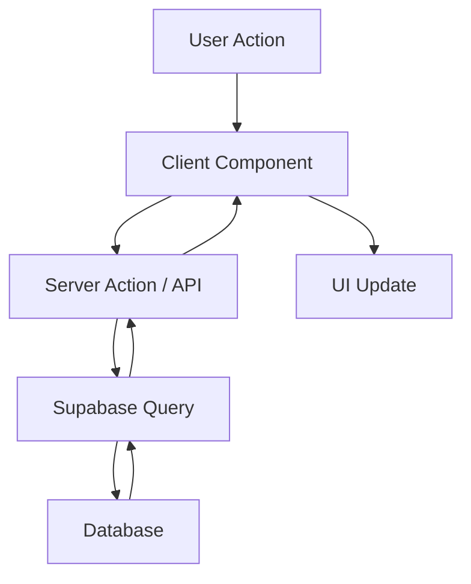

# Feature PRP Template - SafeGamer.ai

Use this template to create a comprehensive Product Requirements Plan for new SafeGamer features.

---

# [FEATURE NAME] PRP

**GitHub Issue:** GH-###
**Created:** [DATE]
**Author:** [NAME]
**Status:** Draft | Ready | In Progress | Complete

## Overview

### Problem Statement
[What problem does this feature solve? Why do parents need it?]

### Solution
[High-level description of the feature]

### Success Criteria
- [ ] [Measurable outcome 1]
- [ ] [Measurable outcome 2]
- [ ] [Measurable outcome 3]

### Tier Availability
- [ ] Free
- [ ] Basic
- [ ] Premium

---

## Worktree Setup

```bash
# Create feature branch and worktree
git worktree add ../safegamer-ai-worktrees/GH-###-feature-name -b feature/GH-###-feature-name dev

# Navigate to worktree
cd ../safegamer-ai-worktrees/GH-###-feature-name
```

---
## Execution

This PRP is executed by Opus 4.6 via `/start-task`. The orchestrator reads this document,
decides which sections to implement based on task complexity, and invokes specialist agents
as needed. Phases below are **planning content** — Opus 4.6 may skip, reorder, or parallelize
them based on what the task actually requires.

| Task Size | Which phases Opus 4.6 will use |
|-----------|-------------------------------|
| Bug fix | Skip to Phase 5+ (security/review only if auth/RLS touched) |
| Small feature (no new table) | Phase 2 backend, Phase 3 frontend, Phase 5+ |
| Full feature (new table) | All phases |
| Auth/payments | All phases + mandatory Phase 5 security |

---


## Phase 1: Architecture

**Agent:** `/software-architect`

### Database Schema

```sql
-- New tables (if any)
CREATE TABLE IF NOT EXISTS feature_table (
    id UUID PRIMARY KEY DEFAULT gen_random_uuid(),
    family_id UUID NOT NULL REFERENCES families(id) ON DELETE CASCADE,
    -- Add columns here
    created_at TIMESTAMPTZ DEFAULT NOW(),
    updated_at TIMESTAMPTZ DEFAULT NOW()
);

-- RLS (MANDATORY)
ALTER TABLE feature_table ENABLE ROW LEVEL SECURITY;

CREATE POLICY "family_access" ON feature_table
    FOR ALL
    USING (family_id IN (
        SELECT family_id FROM family_members WHERE id = auth.uid()
    ));

-- Index
CREATE INDEX idx_feature_table_family_id ON feature_table(family_id);
```

### API Endpoints

| Method | Path | Description | Auth Required |
|--------|------|-------------|---------------|
| GET | `/api/feature` | List items | Yes |
| POST | `/api/feature` | Create item | Yes |
| PUT | `/api/feature/[id]` | Update item | Yes |
| DELETE | `/api/feature/[id]` | Delete item | Yes |

### Data Flow



### Deliverables
- [ ] Database schema finalized
- [ ] API contracts documented
- [ ] Data flow diagram created

---

## Phase 2: Backend

**Agent:** `/backend-developer`

### Migration File

Location: `infrastructure/supabase/migrations/XXX_add_feature.sql`

```sql
-- Copy schema from Phase 1
```

### API Routes

#### GET /api/feature

Location: `app/api/feature/route.ts`

```typescript
import { createClient } from '@/lib/supabase/server'
import { NextResponse } from 'next/server'

export async function GET(request: Request) {
  const supabase = await createClient()

  const { data: { user } } = await supabase.auth.getUser()
  if (!user) {
    return NextResponse.json({ error: 'Unauthorized' }, { status: 401 })
  }

  const { data, error } = await supabase
    .from('feature_table')
    .select('*')
    .order('created_at', { ascending: false })

  if (error) {
    return NextResponse.json({ error: error.message }, { status: 500 })
  }

  return NextResponse.json({ data })
}
```

### Server Actions (if applicable)

Location: `app/actions/feature.ts`

```typescript
'use server'

import { createClient } from '@/lib/supabase/server'
import { revalidatePath } from 'next/cache'
import { z } from 'zod'

const FeatureSchema = z.object({
  // Define input schema
})

export async function createFeature(formData: FormData) {
  const supabase = await createClient()

  const { data: { user } } = await supabase.auth.getUser()
  if (!user) return { error: 'Unauthorized' }

  // Validate and insert
  // ...

  revalidatePath('/feature')
  return { success: true }
}
```

### Deliverables
- [ ] Migration file created
- [ ] API routes implemented
- [ ] Server actions implemented
- [ ] Input validation with Zod

---

## Phase 3: Frontend

**Agent:** `/frontend-developer`

### Page Structure

```
app/(back)/feature/
├── page.tsx              # Main page (server component)
├── feature-list.tsx      # List component (client)
├── feature-form.tsx      # Create/edit form (client)
└── feature-card.tsx      # Item display (server)
```

### Main Page

Location: `app/(back)/feature/page.tsx`

```tsx
import { createClient } from '@/lib/supabase/server'
import { FeatureList } from './feature-list'

export default async function FeaturePage() {
  const supabase = await createClient()

  const { data } = await supabase
    .from('feature_table')
    .select('*')
    .order('created_at', { ascending: false })

  return (
    <div className="container mx-auto p-6">
      <h1 className="text-2xl font-bold mb-6">[Feature Name]</h1>
      <FeatureList items={data || []} />
    </div>
  )
}
```

### UI Components

List required shadcn/ui components:
- [ ] Card
- [ ] Button
- [ ] Input
- [ ] Dialog
- [ ] Table (if applicable)

### Deliverables
- [ ] Main page created
- [ ] Subcomponents implemented
- [ ] Forms with validation
- [ ] Loading/error states
- [ ] Responsive design

---

## Phase 4: Testing

**Agent:** `/test-automation`

### Unit Tests

Location: `__tests__/feature/`

```typescript
// feature.test.ts
import { describe, it, expect } from 'vitest'

describe('Feature Utils', () => {
  it('should handle edge case', () => {
    // Test
  })
})
```

### Integration Tests

```typescript
// api/feature.test.ts
describe('GET /api/feature', () => {
  it('returns 401 for unauthenticated requests', async () => {
    // Test
  })

  it('returns data for authenticated users', async () => {
    // Test
  })
})
```

### E2E Tests

Location: `e2e/feature.spec.ts`

```typescript
import { test, expect } from '@playwright/test'

test.describe('Feature', () => {
  test('user can create and view feature', async ({ page }) => {
    // E2E flow
  })
})
```

### Deliverables
- [ ] Unit tests (80%+ coverage)
- [ ] Integration tests for API
- [ ] E2E test for happy path

---

## Phase 5: Security

**Agent:** `/security-auditor`

### Security Checklist

#### RLS
- [ ] Table has RLS enabled
- [ ] SELECT policy scoped to family_id
- [ ] INSERT policy with proper WITH CHECK
- [ ] UPDATE/DELETE policies if applicable

#### Authentication
- [ ] API routes verify auth.getUser()
- [ ] Server actions check user session
- [ ] No unauthenticated access paths

#### Input Validation
- [ ] All inputs validated with Zod
- [ ] File uploads restricted (if applicable)
- [ ] Size limits enforced

#### COPPA Compliance
- [ ] No child data exposed inappropriately
- [ ] Parental consent respected
- [ ] Data minimization followed

### Deliverables
- [ ] Security audit complete
- [ ] All issues addressed

---

## Phase 6: Code Review

**Agent:** `/code-reviewer`

### Review Checklist

- [ ] Code follows SafeGamer conventions
- [ ] No hardcoded family IDs
- [ ] TypeScript types properly defined
- [ ] No console.log in production code
- [ ] Error handling complete
- [ ] Loading states implemented
- [ ] Accessibility considered

### Deliverables
- [ ] Code review complete
- [ ] All issues addressed

---

## Phase 7: Documentation

**Agent:** `/documentation-writer`

### Required Documentation

- [ ] JSDoc for complex functions
- [ ] API endpoint documentation (if public)
- [ ] User guide (if user-facing feature)
- [ ] README in feature directory (if complex)

### Deliverables
- [ ] Documentation complete

---

## Phase 8: Deployment

**Agent:** `/devops-infrastructure`

### Validation Gates

```bash
# Type check
npx pnpm run type-check

# Lint
npx pnpm run lint

# Build
npx pnpm run build

# Tests
npx pnpm run test
```

### Deployment Checklist

- [ ] All validation gates pass
- [ ] PR created to `dev`
- [ ] Preview deployment works
- [ ] Manual testing complete

### PR Template

```markdown
## Summary
[Feature description]

## Changes
- Added [feature]
- Created [files]

## Testing
- [ ] Unit tests pass
- [ ] E2E tests pass
- [ ] Manual testing complete

## Screenshots
[If UI changes]

---
Closes GH-###
```

### Deliverables
- [ ] PR created and ready for review

---

## Manual Testing Checklist

Before marking complete:

- [ ] Feature works as expected
- [ ] Works on mobile viewport
- [ ] Dark mode displays correctly
- [ ] No console errors
- [ ] Loading states show properly
- [ ] Error states handled gracefully

---

## Rollback Plan

If issues arise in production:

1. Revert PR merge
2. If database changes: Run rollback migration
3. Notify team in Slack

---

## Notes

[Any additional context, decisions made, or future considerations]

---

**Template Version:** 1.1 — Updated for Opus 4.6 intelligent orchestration
**Last Updated:** 2025-12-28
